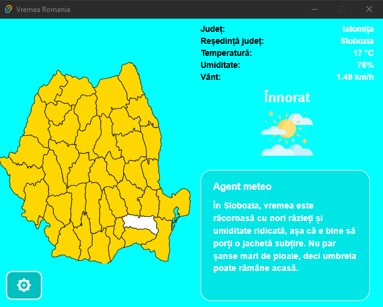

# Vremea România Desktop

Aplicație desktop realizată cu **React** și **Tauri**, care afișează vremea pentru județele României și generează o recomandare scurtă folosind OpenAI.

Utilizatorul selectează un județ de pe harta României, iar aplicația preia date meteo prin OpenWeather API. Pe baza acestor date, aplicația afișează temperatura, umiditatea, viteza vântului, descrierea vremii și o recomandare generată de AI.



## Tehnologii folosite

- React
- Tauri
- JavaScript
- npm
- OpenWeather API
- OpenAI API

## Cerințe

Pentru rulare este necesar să fie instalate:

- Node.js
- npm
- Tauri prerequisites

Aplicația necesită chei API pentru:

- OpenWeather
- OpenAI

Cheile se introduc din fereastra de setări la prima pornire a aplicației.

## Instalare

După descărcarea proiectului, se instalează dependențele cu:

```bash
npm install

## Rulare

```bash
npm run tauri dev